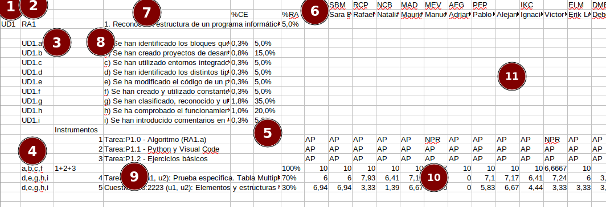
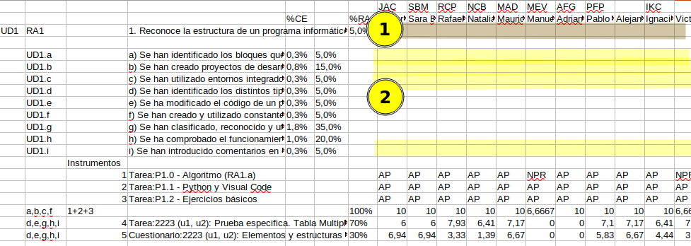
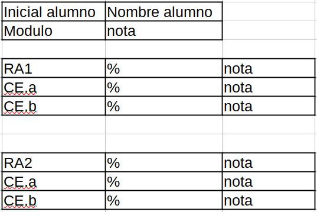

# Actividad: Recuperación módulo de programación

**ID actividad: Recu.1**

**Agrupamiento de la actividad**: Individual

---

### Descripción:

La actividad consiste en procesar *un conjunto de archivos* en formato csv, que están almacenados en una carpeta.

Los archivos contienen las calificaciones de los instrumentos con los que los alumnos del ciclo se han evaluado. El procesamiento consisten en calcular las calificaciones de los criterios de evaluación y resultados de aprendizaje en base a las calificaciones de los instrumentos y las ponderaciones de estos establecidas en el archivo csv.

> nota: Analiza con cuidado el formato del archivo base y su formato, puesto que cualquier cambio tendrá que ser compatible para que no haya problemas al intentar leer el csv desde cualquier aplicación que soporta este archivo.

El formato de los archivos será similar al siguiente:

1. id de la unidad (Un)
2. id del resultado de aprendizaje (RA)
3. id de los criterios de evaluación (CE). Normalmente se trabajará con la letra después del punto.
4. ids de los CE afectados (para los que se calculará la nota) por el instrumento.
5. Porcentajes que pesa cada CE, en base a los cuales se obtiene la nota total del resultado de aprendizaje.
6. id y nombre del alumnado
7. descripción del RA
8. descripción de cada uno de los CE
9. id y descripción de los instrumentos usados para calcular la nota de los CE. Ten en cuenta que a continuación está el peso en porcentaje, que tiene cada instrumento.
10. notas de los instrumentos.
11. área de calculo, en el que se tendrán que calcular las otras de CE y RA.

1. notas de los RA
2. notas de los CE

> nota: Cualquier duda sobre el formato, aclárala antes de continuar.

#### Opciones de ejecución del programa.

Estas opciones se le tienen que indicar al programa al ejecutarlo:

- `-mo`: indica al programa el `módulo`. Si no se indica nada, se asume el módulo de programación, que se identifica como `PRO`.
  `recu -mo PRO`
- `-pi`: indica al programa la carpeta origen en la que se encuentran los archivos a procesar.
  `recu -pi <pathALaCarpeta>`
- `-bd`: indica al programa que la información que se muestra por pantalla tiene que quedar reflejada en base de datos.  Si ya existe, tendrá que actualizarse.
  `recu -bd`
- `-bd d`: indica al programa que borre la información que hay en la base de datos, quedando limpia de toda información.
  `recu -bd d`
- `-bd q`: indica al programa que consulte la información que hay en la base de datos. Mostrando por consola en el mismo formato indicado anteriormente.
  `recu -bd q`

> nota: es posible la combinación de los parámetros anteriores siempre y cuando tengan sentido, por ejemplo puedo indicarle:
> `recu -mo PRO -pi /home/usuario/csvfiles -bd`

#### Lectura y parseo del archivo

##### [*]

La ruta a la carpeta en la que se encuentran los archivos csv se pasará como parámetro cuando se ejecute el programa. El programa deberá procesar todos los archivos que encuentre en la carpeta.

> Nota: Para el procesamiento de los archivos no se podrá usar ninguna biblioteca adicional que no sea la clase `FILE` y demás clases que permite leer y escribir en archivos.

#### Salida

##### [*] **Consola**

El programa mostrará como salida, en formato tabla, las calificaciones del módulo teniendo en cuenta que ésta calificación se calcula en base a la nota acumulada de todos los archivos procesados, es decir, la calificación de los resultados de aprendizaje, las calificaciones de los criterios de evaluación. En la tabla tiene que aparecer el id de cada uno de los elementos (Módulo, RAs, CEs), la descripción y finalmente la calificación. Las tablas serán similares al siguiente diseño:

##### [*] **Archivo**

Tras cada procesamiento, el archivo que se pasa como entrada se modificará para dejar constancia de las calificacioens que se han obtenido en los distintos elementos (RAs, CEs). Inicialmente se podrá pasar vacio, pero en posteriores llamadas es posible que las calificaciones ya estén establecidas y por tanto se tendrán que actualizar con los nuevos valores calculados.

##### [U7] **Interface gráfica**

De igual forma, el programa mostrará en la interfaz gráfica las calificaciones, en un diseño similar al siguiente:

En el que se podrá seleccionar los alumnos y mostrará un resumen de sus notas, tal y como se ve en la imagen anterior.

##### [U9] **base de ddtos**

De igual forma, el programa almacenará en base de datos los resultados de procesar los archivos, quedando constancia de las calificaciones del alumnado para los distintos elementos que forman parte de estas. (Módulo, RAs, CEs).

Conforme se vayan procesando archivos, se tendrán que incorporar los nuevos elementos y actualizar la calificación del módulo.

En el que se podrá seleccionar los alumnos y mostrará un resumen de sus notas, tal y como se ve en la imagen anterior.

**Trabajo a realizar:**

1. Trabajar sobre el formato de los datos y el parseo de estos.
2. Trabajar sobre el parseo de argumentos pasados al ejecutar el programa.
3. Separa la entrada de datos, procesamiento de datos, salida de datos.
4. Usa patrones de diseño, jerarquia de clases.
5. Asigna una única responsabilidad por clase, y por métodos.
6. Pon nombres coherentes y adecuados a la responsabilidad que realiza la clase (Sustantivos) /métodos (verbos)
7. Construir una estructura de datos/clases que soporte lainformación en memoria y facilite realizar las tareas de procesamiento de la información.
8. Trabajar por partes las distintas salidas:
   a. salida a ficheros.
   b. salida a consola.
   c. salida a base de datos.
   d. interface gráfica.
9. Documentar y comentar.
10. Genera el ejecutable.
11. Crear las capturas de pantallas de aquellas ejecuciones y opciones que funcionen.

### Recursos

* Apuntes dado en clase
* Recursos vistos en clase.

### Evaluación y calificación

#### RA y CE evaluados:

Se evaluarán las siguientes unidades, con su RA y CE asociados.

##### Unidad 4.

a) Entender los fundamentos de la POO
i) Haciendo uso del IDE, b) escribir programa simples en los que:
c) Se instancian objetos a partir de clases predefinidas, h) haciendo uso de constructores
d) Se utilicen métodos, f) haciendo uso de parámetros en la llamada, y propiedades de los objetos.
e) Se llamen a métodos estáticos.
g) Se incorporan y utilizan librerías.

##### Unidad 5.

a) Entender la sintaxis, estructura y componentes típicos de una clase.
b,c) Definir clases, con sus e) constructores, d) propiedades y métodos, i) métodos estáticos, en los que se utilicen g) los mecanismos para controlar la visibilidad de clase y miembros.
f) Desarrollar programas que instancien y utilicen objetos de las clases creadas anteriormente.
h) Definir y utilizar clases heredadas e j) interfaces.
k) Crear y utilizar librerías.

##### Unidad 6.

a) Entender los conceptos de herencia, superclase y subclase.
g) Crear programas en los que e) implementen y utilicen jerarquías de clases, para ello d) crear clases heredadas que sobrescriban la implementación de métodos de la superclase, c) reconociendo la incidencia de los constructores en la herencia y b) utilizando modificadores para bloquear y forzar la herencia de clases y métodos.
f) Se han probado y depurado las jerarquías de clases.
h) Se ha comentado y documentado el código.

##### Unidad 7.

a) Se ha utilizado la consola para realizar operaciones de entrada y salida de información, y b) Se han aplicado formatos en la visualización de la información.
c) Conocer las posibilidades de entrada/salida del lenguaje y las librerías asociadas, d) utilizado ficheros para almacenar y recuperar información y e) que utilicen diversos métodos de acceso al contenido de los ficheros.
f) Se han utilizado el IDE para crear interfaces gráficos de usuario simples, en las que se g) se controlen eventos, y h) se utilice la gui para la entrada y salida de información.

##### Unidad 9.

a) Se han identificado las características y métodos de acceso a sistemas gestores de bases de datos relacionales.
b) Se han creado programas en las que crear conexiones con bases de datos, para c) almacenar información en bases de datos, d) recuperar y mostrar información almacenada en bases de datos, efectuar e) borrados y modificaciones sobre la información almacenada y f) que ejecuten consultas sobre bases de datos.
g) Se han creado aplicaciones para posibilitar la gestión de información presente en bases de datos relacionales.

#### **Rubrica**:

Se construirá en base a la información anterior.

**Conlleva presentación**: SI

### Entrega

> **La actividad tiene que cumplir las condiciones de entrega para poder ser calificada. En caso de no cumplirlas podría calificarse como no entregada.

* **Conlleva la entrega de capturas de pantallas de las distintas opciones:** Se entregará un documento que contendrán capturas de pantalla de las distintas ejecuciones del programa, mostrando aquellas que funcionan correctamente. Solo se pasará a evaluar aquellas que tengan una captura de pantalla sobre su funcionamiento.
* **Conlleva la entrega un ejecutable del programa:** Se tendrá que entregar un enlace al ejecutable del programa, de forma que se pueda probar sin necesidad de ejecutar el IDE. Este enlace puede estar en github.
* **Conlleva la entrega de URL a repositorio:** El contenido se entregará en un repositorio github, y en caso de creerlo necesario se trabajará por proyectos dejando constancia de las acciones realizas según cada uno de los perfiles de los usuarios del grupo.
